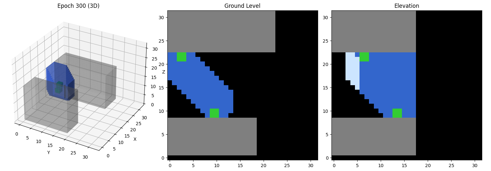

# Constraint-Based Architectural NCA

[](https://www.python.org/downloads/)
[](https://pytorch.org/)
[](https://opensource.org/licenses/MIT)

**Neural Cellular Automata for Generative Architectural Design**

A research project exploring whether Neural Cellular Automata (NCA) can serve as a generative tool for architectural design, producing constraint-satisfying volumetric structures in urban contexts.

<p align="center">
  
  
</p>

---

## Features

- **3D Neural Cellular Automata** - Voxel-based generative model using local update rules
- **Architectural Constraints** - Structural validity, corridor coverage, ground openness, thickness limits
- **Interactive Web UI** - Real-time 3D visualization with adjustable parameters
- **Fine-tuning Support** - Customize model for different aesthetic goals (porosity, density)
- **Google Colab Compatible** - Train and fine-tune on free GPU resources

---

## Quick Start

### Option 1: Run the Web UI (Inference Only)

```bash
# Clone the repository
git clone https://github.com/YOUR_USERNAME/Constraint-Based-Architectural-NCA.git
cd Constraint-Based-Architectural-NCA

# Install dependencies
pip install -r deploy/requirements.txt

# Run the server
python deploy/server.py
```

Open `http://localhost:8000` in your browser.

### Option 2: Google Colab (Training/Fine-tuning)

1. Upload the project to Google Drive
2. Open `notebooks/NB_Finetune_Porosity_Colab.ipynb` in Colab
3. Set your project path and run all cells

---

## Web Interface

The interactive dashboard allows you to:

- **Configure buildings** - Add/remove/resize gray context buildings
- **Place access points** - Ground-level and elevated entry points
- **Adjust generation parameters** - Steps, noise, corridor settings
- **Toggle visibility** - Show/hide structure, buildings, access points, anchors
- **Real-time preview** - See constraint zones before generation

### Controls

| Parameter | Description |
|-----------|-------------|
| Seed | Random seed (-1 for random) |
| Steps | NCA iteration count (30-100) |
| Threshold | Voxel binarization cutoff |
| Noise | Per-step randomness |
| Corridor Seed Scale | Initial structure bias along corridors |
| Corridor Width | Path thickness between access points |

---

## Project Structure

```
Constraint-Based-Architectural-NCA/
├── deploy/                      # Web deployment
│   ├── server.py                # FastAPI backend
│   ├── model_utils.py           # NCA model & utilities
│   ├── index.html               # Web interface
│   ├── static/                  # CSS & JavaScript
│   └── requirements.txt         # Python dependencies
│
├── notebooks/                   # Jupyter notebooks
│   ├── sel/MODEL C*/            # Trained model checkpoint
│   ├── NB_Finetune_Porosity.ipynb        # Local fine-tuning
│   └── NB_Finetune_Porosity_Colab.ipynb  # Colab fine-tuning
│
├── scripts/                     # Utility scripts
│   └── finetune_porosity.py     # CLI fine-tuning script
│
├── docs/                        # Documentation
│   ├── FINETUNE_POROSITY_PLAN.md
│   ├── STEP_B_APPROACH.md
│   └── ...
│
└── assets/                      # Images for README
```

---

## Model Architecture

### Neural Cellular Automata

- **Grid Size**: 32³ voxels
- **Channels**: 8 (4 frozen input, 4 grown output)
- **Perception**: 3D Sobel filters (identity + gradients)
- **Update Network**: 3-layer MLP as 1×1×1 convolutions
- **Hidden Dimension**: 96

### State Channels

| Channel | Type | Description |
|---------|------|-------------|
| 0 | Frozen | Ground plane |
| 1 | Frozen | Existing buildings |
| 2 | Frozen | Access points |
| 3 | Frozen | Anchor zones (legal ground contact) |
| 4 | Grown | **Structure** (output) |
| 5 | Grown | Surface detection |
| 6 | Grown | Alive mask |
| 7 | Grown | Hidden state |

---

## Constraints

The model is trained to satisfy multiple architectural constraints:

| Constraint | Target | Description |
|------------|--------|-------------|
| **Legality** | 100% | No structure inside existing buildings |
| **Coverage** | >70% | Fill the corridor zone between access points |
| **Spill** | <20% | Don't grow outside corridor zone |
| **Ground Openness** | >80% | Keep street level open for circulation |
| **Thickness** | >90% | No bulky masses (max 2 voxels thick) |
| **Fill Ratio** | 5-15% | Sparse, efficient structures |

---

## Fine-Tuning

Fine-tune the model for different aesthetic goals:

### Porosity Fine-Tuning

Creates lighter, more porous lattice-like structures:

```bash
# Using the script
python scripts/finetune_porosity.py --epochs 150 --lr 0.0005

# Or use the Colab notebook
notebooks/NB_Finetune_Porosity_Colab.ipynb
```

**Changes from base model:**
- Increased thickness penalty (30 → 50)
- Increased sparsity penalty (30 → 45)
- New PorosityLoss (25% internal voids)
- New SurfaceAreaLoss (articulated forms)
- Reduced max_thickness (2 → 1)

See `docs/FINETUNE_POROSITY_PLAN.md` for details.

---

## Requirements

- Python 3.8+
- PyTorch 2.0+
- FastAPI & Uvicorn (for web UI)
- NumPy

```bash
pip install torch numpy fastapi uvicorn pydantic
```

---

## Documentation

| Document | Description |
|----------|-------------|
| [PROJECT_DEFINITION.md](PROJECT_DEFINITION.md) | Plain language project description |
| [SPECIFICATION.md](SPECIFICATION.md) | Technical specification |
| [MATHEMATICAL_FOUNDATIONS.md](MATHEMATICAL_FOUNDATIONS.md) | Mathematical formulation |
| [CONSTRAINT_SPECS.md](CONSTRAINT_SPECS.md) | Constraint implementation details |
| [SCALING_AND_DEPLOYMENT_PLAN.md](SCALING_AND_DEPLOYMENT_PLAN.md) | Deployment roadmap |
| [docs/FINETUNE_POROSITY_PLAN.md](docs/FINETUNE_POROSITY_PLAN.md) | Fine-tuning guide |

---

## Research Background

This project investigates whether Neural Cellular Automata can serve as a generative architectural design tool. NCAs use local update rules to grow complex global structures, making them interesting for architectural applications where local construction logic produces emergent spatial qualities.

### Core Research Questions

1. Can NCA learn to satisfy multiple architectural constraints simultaneously?
2. Can NCA learn to protect void (absence) rather than just generate mass?
3. Does the model generalize to novel building configurations?
4. Can fine-tuning adjust aesthetic qualities while maintaining constraints?

### Key Findings

- NCAs can successfully learn multi-constraint architectural generation
- Corridor-based void protection is learnable
- Model generalizes to different building configurations
- Fine-tuning enables aesthetic control (porosity, density)

---

## Citation

```bibtex
@misc{constraint-architectural-nca-2025,
  title={Constraint-Based Architectural NCA: Neural Cellular Automata for Urban Pavilion Generation},
  author={[Your Name]},
  year={2025},
  howpublished={\url{https://github.com/YOUR_USERNAME/Constraint-Based-Architectural-NCA}}
}
```

---

## Acknowledgments

This work builds on:
- [Growing Neural Cellular Automata](https://distill.pub/2020/growing-ca/) (Mordvintsev et al., 2020)
- [Growing 3D Artefacts and Functional Machines](https://arxiv.org/abs/2103.08737) (Sudhakaran et al., 2021)
- Research on cellular automata in architecture (Frazer, 1995; Shiffman, 2012)

---

## License

MIT License - see [LICENSE](LICENSE) for details.

---

## Contributing

Contributions are welcome! Please feel free to submit issues and pull requests.

1. Fork the repository
2. Create your feature branch (`git checkout -b feature/amazing-feature`)
3. Commit your changes (`git commit -m 'Add amazing feature'`)
4. Push to the branch (`git push origin feature/amazing-feature`)
5. Open a Pull Request
