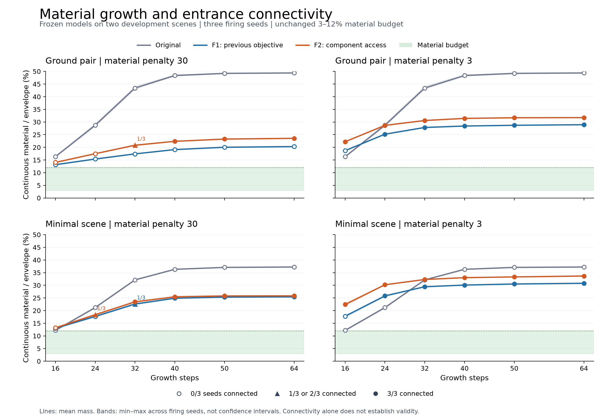

# H1: growth connects entrances but exceeds the material budget

2026-09-23. Full run `20260923T150119Z_f7b304516723`, source `3acdefd`.
This is a frozen-model diagnostic: zero optimizer updates and no promoted model.

## Measured result

None of 180 evaluated fields meets both entrance connectivity and the unchanged
3%-12% continuous material/envelope budget. All 144 fitted F1/F2 fields exceed
12%. One original-model field is in budget but disconnected. The newer F2 models
connect every tested firing seed from 40 steps onward, while continuing to use
too much material. No established connection is lost between sampled horizons.
The evidence therefore identifies excessive growth, not observed connectivity
collapse. It does not certify behavior between samples or beyond 64 steps.

The matrix contains two original model/scene controls, four F1 and four F2 models,
three firing seeds (0, 1, 2), and six growth horizons. Each horizon restarts the
same scaffold and random prefix. These are two development scenes and one
training seed, not independent model replications or fresh holdout performance.

| Growth steps | Original connected / 6 | F1 connected / 12 | F2 connected / 12 | F1 mass range | F2 mass range |
|---:|---:|---:|---:|---:|---:|
| 16 | 0 | 0 | 6 | 12.68%-18.84% | 12.86%-22.88% |
| 24 | 0 | 6 | 7 | 15.20%-26.01% | 17.38%-30.27% |
| 32 | 0 | 7 | 10 | 17.39%-29.54% | 20.57%-32.43% |
| 40 | 0 | 9 | 12 | 19.06%-30.21% | 22.32%-33.04% |
| 50 | 0 | 9 | 12 | 19.84%-30.60% | 23.12%-33.42% |
| 64 | 0 | 9 | 12 | 20.09%-30.91% | 23.48%-33.90% |

Lines show mean mass; bands show the minimum and maximum across three firing
seeds, not confidence intervals. Original controls appear in both recipe panels
for comparison; they are the same data. Connectivity uses strict material >0.5
and a single legal component touching all entrance regions. The mass budget is
continuous, not a count of thresholded occupied voxels.

All 30 source/seed trajectories have higher mass at 64 than at 16 steps. Only
three source/horizon combinations have firing-sensitive connectivity (1/3
connected): F1 mapped_30 minimal at 32, F2 mapped_30 ground at 32, and F2 mapped_30
minimal at 24. F2 mass_3 connects both scenes for all three seeds already at 16.
Changing the stopping horizon alone yields no jointly successful case here.

## What the gradients add

Eight new F2 gradient cases use firing seed 2 at 16/50 steps. Twelve verified
original/F1 cases reuse A2 evidence; they were not differentiated again. Complete
parameter vectors and last-raw-field derivatives are retained separately.

| F2 model | Access/sparsity cosine, 16 steps | Total/sparsity cosine, 16 steps | Total/sparsity cosine, 50 steps |
|---|---:|---:|---:|
| mapped_30, ground | -0.774 | +0.128 | +0.998 |
| mapped_30, minimal | -0.921 | +0.130 | +1.000 |
| mass_3, ground | -0.895 | -0.333 | +1.000 |
| mass_3, minimal | -0.847 | -0.238 | +0.905 |

At 16 steps, both access and coverage gradients oppose sparsity reduction in all
four F2 cases. In mass_3, even the complete objective gradient opposes sparsity;
mapped_30 gives weak positive alignment. At 50 steps, candidate access loss and
its parameter gradient are zero in all four cases, while total gradients strongly
align with sparsity. The material penalty therefore has a usable parameter
gradient at those later states; it is not globally blocked.

Above the upper budget, sparsity is `150 * (mass - 0.12)^2`, so reducing it locally
reduces mass. Cosines describe local gradient-descent directions, not the actual
Adam step with accumulated moments, and do not prove why training produced a
particular model or that a different schedule will converge. Zero access-gradient
cosines at 50 steps are undefined, not zero. A2's old-access zero gradients apply
to its 12 cases; some newly measured F2 states have nonzero old-access gradients.

## Decision and practical implication

Test exposure to longer growth during training as the next isolated change:
alternate 16 and 50 steps under the existing F2 objective. Existing training only
optimizes 16-step rollouts, whereas the later evaluated states show a different
objective tradeoff. This motivates a test; it does not establish the schedule as
a solution. See [the F3 plan](HORIZON_TRAINING_PLAN.md) and D044.

Keep architecture, scenes, nine families, coefficients and the material budget
fixed. Defer pools, access-margin changes and larger grids until this comparison.
W1/D1 already establish numerical feasibility on these contracts, but cannot
prove the NCA will learn it. Deployment and fresh-scene generalization remain
separate later milestones; no claim of architectural or mechanical validity.

## Preservation and verification

- Regression `20260923T145719Z_37715b17ba45`: 168 tests pass, zero failures,
  errors or skips; original-checkpoint smoke exit 0. Code unchanged afterward.
- Pilot `20260923T145912Z_17b1d18f5b10`: 12 growth fields, two new gradient cases,
  73.50 seconds; timing-only estimate 989.49 seconds admitted the 1500-second cap.
- Full H1: 180 growth fields, eight new gradients, 12 reused cases, 603.78 seconds.
  All worker and full elapsed caps met; no failures or optimizer updates.
- Verification: 31 source hashes, 180 rescored fields, 150 sampled transitions,
  20 exact historical anchors, 20 exact gradient forward fields, 120 parameter
  vectors, 120 raw vectors, 720 cosines and 10 unchanged-model checks.
- Scoring reuses shared formulas; connectivity also uses independent BFS.
  Vector statistics are recomputed, not independently differentiated.

Individual failures, losses, metrics and evidence references are in
[H1-growth.md](../../experiments/reports/H1-growth.md),
[H1-evidence.json](../../experiments/reports/H1-evidence.json),
[H1-outcomes.json](../../experiments/reports/H1-outcomes.json) and
[H1-verification.json](../../experiments/reports/H1-verification.json).
Raw arrays, gradients, checkpoints, source snapshots and logs remain under
`.local-artifacts/runs/`; post-hoc scripts/receipts remain under
`.local-artifacts/analysis-attempts/`. Neither these reports nor charts replace
the raw evidence. Archive status is recorded in the milestone receipt described
in RESUME.md; local same-disk copies are not off-device backups.
