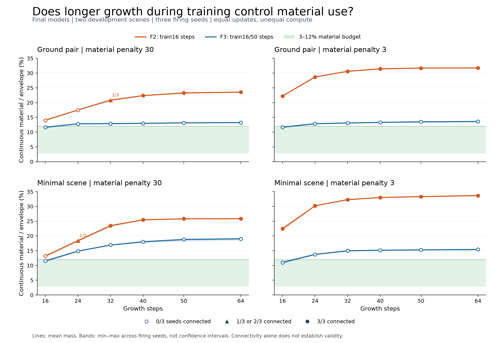

# F3: less material, but lost connectivity

2026-09-23. Full study `20260923T160713Z_cc33850561b8`, scientific source
`c0a44b1`. **Do not adopt this mixed-horizon schedule.** It reduced material in
all 72 matched final cases but lost all 59 connections present in the F2 control
grid, gaining none. No F3 evaluation jointly satisfies connectivity and budget.
This is a reproducible negative result, not a recovery or scoring failure.

## What changed

Four models kept F2's original initialization, architecture, optimizer, two
development scenes, training seed, recipes, nine constraint families and three
regularizers. Training alternated16/50 growth steps instead of always16. Each
model received64 updates:2112 recurrent steps versus1024 for F2. Update counts
match; compute and firing-RNG consumption do not. No state pool or warm start.

## Measured outcomes

Each row below contains four final models crossed with three firing seeds.
F2 results reuse the verified H1 controls. The material budget remains3%-12%
continuous material/envelope volume, tolerance1e-6; connectivity uses strict
occupancy>0.5 and a single legal component touching every entrance region.

| Growth steps | F2 connected / 12 | F3 connected / 12 | F3 in budget / 12 | F2 mass range | F3 mass range |
|---:|---:|---:|---:|---:|---:|
| 16 | 6 | 0 | 12 | 12.86%-22.88% | 10.64%-11.88% |
| 24 | 7 | 0 | 0 | 17.38%-30.27% | 12.72%-14.93% |
| 32 | 10 | 0 | 0 | 20.57%-32.43% | 12.77%-16.94% |
| 40 | 12 | 0 | 0 | 22.32%-33.04% | 12.89%-18.21% |
| 50 | 12 | 0 | 0 | 23.12%-33.42% | 13.08%-19.05% |
| 64 | 12 | 0 | 0 | 23.48%-33.90% | 13.12%-19.28% |

All 56 fixed-boundary F3 evaluations are disconnected, including every final
16/50 firing-seed2 output. Budget passes increase from13/56 F2 to21/56 F3, but
joint successes remain0/56. The final grid adds64 unique evaluations to those
boundaries, for120 unique evaluations total; eight final-boundary cases are
explicitly reused. None of the120 is connected. The72 final-grid cases contain
12 budget passes and zero joint successes. Do not count overlapping cases twice.

All256 training updates exceed the gradient clipping norm before clipping. This
is recorded behavior, not proof that clipping caused the failure. Alternating
training losses use different horizons and cannot be treated as one comparable
convergence curve. Fixed-horizon evaluations provide the comparison.

## A specific lead for the next diagnostic

Candidate access loss equals1 in all72 final-grid cases. A post-hoc inspection of
the already verified raw fields finds the selected critical voxel strictly below
zero in51 cases (minimum -0.05928), and exactly zero in21. The projected material
at that voxel is zero in all72. The access implementation gathers this selected
projected value after detached topology selection.

For a strictly negative raw value, the final hard clamp has zero derivative:
the currently selected access signal cannot pass through that operation. This
is a local chain-rule observation supported by saved fields and code, not a new
parameter-gradient measurement or proof of the whole training trajectory's cause.
The21 exact-zero cases need actual autograd tracing; do not call them strictly
clipped or assume their parameter gradients are zero. Other objective terms can
still provide gradients. At final firing seed2, pre-clamp coverage loss remains
approximately0.696-0.789, so its existence alone did not solve the problem here.

H1 showed useful long-horizon material gradients on F2 states. F3 demonstrates
that exposing those horizons during training does not guarantee useful learned
geometry. It does not establish that all variable-horizon training is harmful,
that the architecture is incapable, or that additional iterations would solve it.
One training seed/two seen scenes cannot establish generalization or statistical
significance; firing seeds are not independent trained-model replications.

## Decision

Keep F3 as experimental evidence; retain F2 as the stronger connectivity control,
also unfit for promotion because of its budget failures. Follow
[ACCESS_RECOVERY_PLAN.md](ACCESS_RECOVERY_PLAN.md): inspect actual gradients at
the failed bottlenecks and test a pre-clamp access-loss extension on frozen
evidence before any further learning run. Keep binary evaluation, geometry,
architecture, budgets and nine families fixed. Avoid another blind schedule or
duration increase. Larger grids and the production model remain separate later
milestones; this result does not establish walkability or mechanical safety.

## Verification and durable records

| Phase | Run | Verified work | Elapsed |
|---|---|---|---:|
| Regression | `20260923T155421Z_8e4d3bfc6919` |172 tests,0 failures/errors/skips; original-checkpoint smoke0 |55.52s |
| F3B parity | `20260923T155551Z_dc2ea609facf` |12 updates/24 evaluations exactly match F2, including full optimizer/RNG states except declared metadata |88.22s |
| F3R recovery | `20260923T155836Z_10e9dbf37b62` |8 executed updates/14 evaluations;11 exact restart checks; five additional intermediate checkpoint comparisons |100.23s |
| F3P timing | `20260923T160209Z_e292a696d594` |8 updates/88 unique evaluations;3246.25s conservative estimate admitted3600s cap |223.38s |
| F3 full | `20260923T160713Z_cc33850561b8` |256 updates/120 unique evaluations; all caps met |1722.77s |
| F3L trained recovery | `20260923T184328Z_418e31921193` |Eight replayed updates63/64 and eight evaluations exactly match all four trained models |118.04s |

The full verifier checks37 source hashes,376 saved fields,260 checkpoint/schedule
cursors,56 F2 boundary controls,72 H1 final controls, eight exact original fields
and eight exact final checkpoint rollouts. F3L adds38 source/wrapper hashes and
eight cursor checks. It re-executes existing updates, adding no training exposure.
Scoring shares formulas; component connectivity also uses independent BFS.
Early recovery alone was not described as proof about trained-state restart.

The objective/evaluation function syntax trees match F2; all31 H1 source files
remain byte-identical. The172-test pass covers the frozen core; the later F3L
wrapper was syntax-checked and validated through its actual eight-update replay.

See [F3-horizon-training.md](../../experiments/reports/F3-horizon-training.md),
[F3-verification.json](../../experiments/reports/F3-verification.json),
[F3-outcomes.json](../../experiments/reports/F3-outcomes.json),
[F3-critical-cells.json](../../experiments/reports/F3-critical-cells.json), and
[F3L-verification.json](../../experiments/reports/F3L-verification.json).
Raw artifacts/source snapshots stay under `.local-artifacts/runs/`; post-hoc
scripts and receipts stay under `.local-artifacts/analysis-attempts/`. The chart's
48 plotted points and source/image hashes were checked and visually inspected.

An automatic approval review timed out before the first F3L launch, reporting
6632.2s tool waiting; no process was created. This was separate from completed
scientific-run timing. A normal authorized local retry succeeded. Plotting-library
access also failed under normal permissions; rendering succeeded with scoped
elevated execution. Failures are documented rather than relabeled as science.
Archive status is in the milestone receipt referenced by RESUME.md. Private
reports remain Git-ignored; no Drive, paid compute, deployment or remote push.
