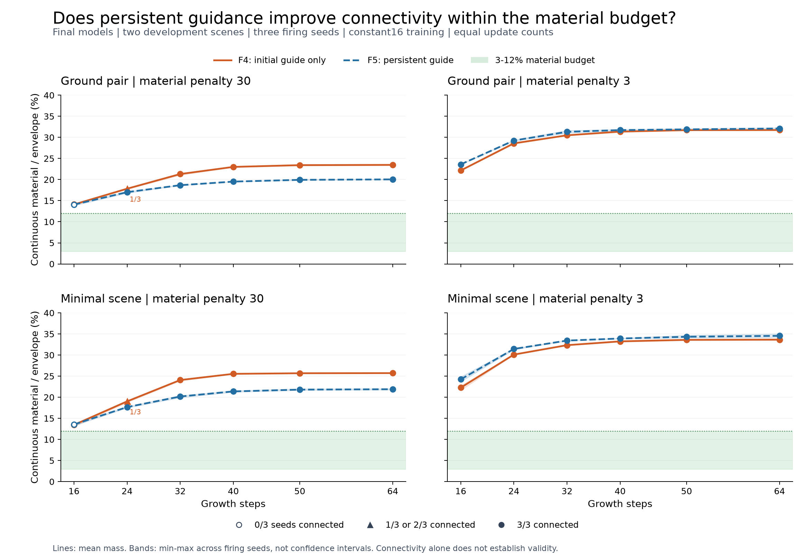

# F5 findings: persistent scaffold conditioning

2026-09-24 (Berlin; run IDs use UTC). Full run `20260923T214035Z_566da8c507c0`, source `27416f30141d6648d798380dfd7fcb191889f69f`. This closes the
bounded local investigation defined in D052. It does not finish the full product
upgrade or certify generalization, architectural utility or structural safety.

## Decision

Persistent guidance did not produce a final design meeting connectivity and the
material budget together. Close this local sequence of incremental loss and
conditioning experiments. Do not launch another loss tweak, longer run or larger
grid by default. Move to a representation and NCA-role review before new learning.

No automatic production promotion. The original checkpoint/defaults remain.
Directional improvements below the acceptance target are still recorded. This
bounded comparison does not establish that longer training, other initialization
or state-pool training cannot work, or that the NCA concept is disproved.

## Matched final results

| Outcome | F4 initial guide only | F5 persistent guide |
|---|---:|---:|
| Connected | 62/72 | 66/72 |
| Within 3-12% material budget | 0/72 | 0/72 |
| Joint connectivity and budget | 0/72 | 0/72 |
| Continuous material/envelope range | 13.09-33.87% | 13.21-35.03% |

F5 retains 62 baseline connections, gains
4 and loses 0. Material falls in
32 matched cases, rises in 40,
and is exactly unchanged in 0.
Mean material/envelope changes from 25.75% to
24.90% across the fixed final grid
(-3.29% relative change).
This is a paired descriptive average, not an independent-trials estimate.
There are 0 joint successes among 56 boundary records;
eight boundary records also appear in the final 72 grid. Use the 120 unique
evaluation count when combining them. Every individual case is retained.

| Growth steps | F4 connected | F5 connected | F5 in budget | F5 joint |
|---|---:|---:|---:|---:|
| 16 | 6/12 | 6/12 | 0/12 | 0/12 |
| 24 | 8/12 | 12/12 | 0/12 | 0/12 |
| 32 | 12/12 | 12/12 | 0/12 | 0/12 |
| 40 | 12/12 | 12/12 | 0/12 | 0/12 |
| 50 | 12/12 | 12/12 | 0/12 | 0/12 |
| 64 | 12/12 | 12/12 | 0/12 | 0/12 |

The 72 final evaluations reuse four models, two development scenes and one
training seed. Three firing seeds measure stochastic growth under those models;
they are not independent training replicates. Bands show their range, not
confidence intervals. F2 remains an additional historical reference (59/72
connections, 0/72 joint in H1); F4 is the sole primary matched control.

Final binary proxy totals: illegal voxels
0, blocked protected-ground voxels
0, geometrically unsupported
voxels 0. All nine family scores,
three regularizers and all historical/projected/raw access definitions remain
in F5-evidence.json. See [all-family comparison](../../experiments/reports/F5-family-comparison.md)
for matched means and case counts. Joint connectivity/budget is only one limited conjunction,
not success on all nine families, walkability or mechanics.

Coverage penalty fell in all 72 matched cases, while the cantilever-boundary
regularizer rose in 23 and was unchanged in 49. Facade, ground, legality and
thickness penalties stayed zero. The stronger material-penalty recipe reduced
material in 32/36 cases; the lower-penalty recipe increased it in all 36. Thus a
small overall mean reduction must not be presented as uniform material efficiency.

## What was isolated

The new model sees exactly the same corridor_legal_v1 scaffold at every growth
step. Its identity/three Sobel features feed a zero-initialized 4->96 projection
before the first ReLU, adding 384 weights. Eight total state/four evolving
channels remain, with the same backbone layers and tensor shapes. The scaffold still contributes
0.15 to the initial material. This is planner information, not scaffold-free
emergence or a new constraint family.

The F4 raw objective, recipes, scenes, training seed, optimizer and 64 constant 16
updates/member are unchanged: 1,024 recurrent training steps each. Both arms start
from original Model C; F5 receives no extra F4 pretraining. The combined gradient
is clipped at the unchanged threshold, now including the 384 new parameters.
256/256 updates were clipped. Guide gradient norms are positive on
256/256 updates, ranging from 12.1994
to 208.835 before clipping. These trace measurements do not isolate
each loss family's contribution or prove that the guide has an architectural role.

| Member | First backbone weight difference from F4 | Clipped updates | Final guide weight norm |
|---|---:|---:|---:|
| mapped_30-r0 | 1 | 64/64 | 0.0819994 |
| mapped_30-r1 | 1 | 64/64 | 0.0833393 |
| mass_3-r0 | 1 | 64/64 | 0.0921202 |
| mass_3-r1 | 1 | 64/64 | 0.0852009 |

Static context is owned by each session, bound to scene/seed/scaffold/config/
device/dtype, and checked against mutation. Only its perception features are
cached; the trainable projection gets a fresh graph each rollout. Legacy model
entry points reject calls that would silently omit conditioning. Historical
model and rollout files are unchanged.

## Verification and execution

Final preparation regression 20260923T212031Z_48dcfddbfd4f:199 tests,
zero failures/errors/skips, original-checkpoint smoke exit 0. Initial 197-test pass
20260923T211811Z_35187d4e6ff3 is also retained; two integration guards were added
before the final pass/source freeze. No scientific code changes after that pass.

| Stage | Run ID | Verification |
|---|---|---|
| F5B parity | 20260923T212257Z_823a2b09b2dd |12 training/24 evaluation records exact versus F4 |
| F5R restart | 20260923T212734Z_efe016a02413 |11 exact early recovery/repeat checks |
| F5P timing | 20260923T213256Z_42130eed3f5d |Fixed pilot admitted unchanged 900-second member / 3,600-second full caps |
| Full F5 | 20260923T214035Z_566da8c507c0 |256 updates,120 unique evaluations, all elapsed caps met |
| F5L trained restart | 20260923T220548Z_fdd27bb79c92 |8 updates/8 evaluations exact from four update 62 checkpoints |

Full training took 1317.67s (21.96 minutes).
Reporter verified 47 source hashes,
376 unique saved fields,
260 checkpoint cursors, 56 F4 boundary
and 72 F4 final controls, eight identical initial fields and eight replayed final
rollouts. Post-hoc analysis compares all 256 backbone checkpoints and five early
recovery checkpoint pairs. Provenance confirms all 41 historical F4 source files
unchanged. Figure aggregates/hashes and visual inspection are recorded separately.
Recovery certifies completed CPU update boundaries, not GPU/AMP or arbitrary
interruptions during file writes. Evaluators share score formulas; binary
component BFS is independent of maximin selection.

## Next decision and preservation

Write the next design specification around a planner-provided valid scaffold
and an NCA with a narrower refinement/recovery role. Compare that hybrid against
the already strong procedural and direct-optimization controls. Retain the architectural material/form-generation scope already accepted in
D026. Specify what learned refinement would add beyond those controls before
changing representation or starting another training experiment. This is a proposed
direction, not an implemented or proven replacement.

Read LOCAL_PHASE_CLOSURE.md for the phase-level handoff. Studio development is
a separate next workstream and can expose current feasibility diagnostics before
a new learned model is ready. No claim of 10x deployment improvement is made here.

All attempts, fields, optimizer/RNG checkpoints, exact source ZIPs, reports,
decisions and analysis receipts remain local. The full milestone archive includes
earlier evidence, private ignored reports and the available primer. Its external
backup receipt is the authority for archive completion. Git may normalize code/
config newlines: use exact snapshot/working-tree-evidence bytes for byte-hash
recovery. No guard bypass. No paid Colab, Drive operation, remote push or deployment.
