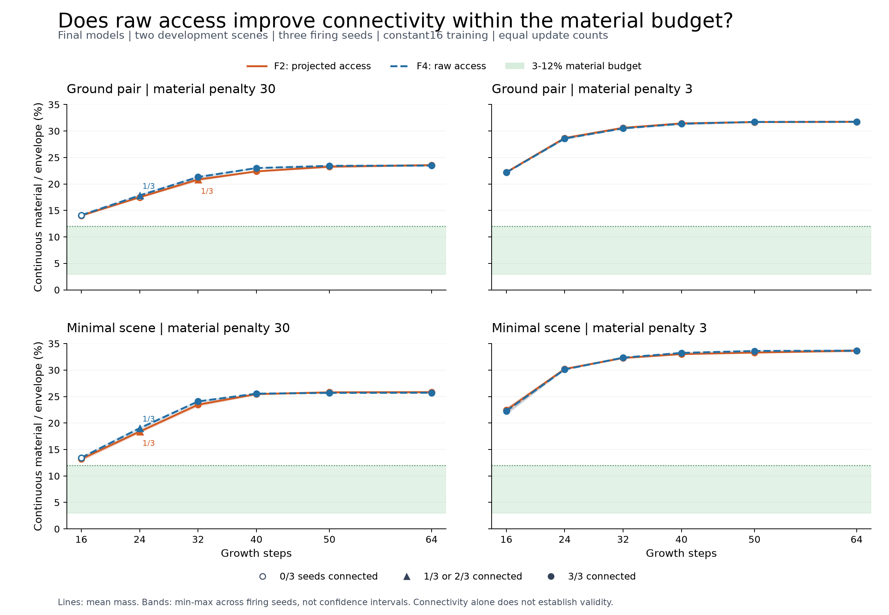

# F4: raw access changes learning, but does not solve the material tradeoff

2026-09-23. Full run `20260923T202649Z_75034cca563c`, scientific source
`373968d0cdd79618753338bafaf2a3b74710489d`. No model promoted.

## Result and decision

The raw-access objective retained all 59 baseline connections and gained three,
reaching 62/72 connected final evaluations. Neither arm produced a final case
within the agreed 3-12% material budget. Joint connectivity and budget success is
0/72 for both arms, and zero across all 120 unique F4 boundary/final evaluations.
This is a limited connectivity improvement on development scenes, not a usable
design improvement or evidence of generalization.

| Final evaluation outcome | F2 projected access | F4 raw access |
|---|---:|---:|
| Connected cases | 59/72 | 62/72 |
| Within material budget | 0/72 | 0/72 |
| Joint connectivity and budget | 0/72 | 0/72 |
| Continuous material/envelope range | 12.86-33.90% | 13.09-33.87% |

F4 reduces material in 30 matched cases, increases it in 38, and leaves it exactly
unchanged in four. Its three connection gains all occur in ground-pair/mapped_30:
24 growth steps with firing seed 2; 32 steps with seeds 1 and 2. Each gain comes
with a small material increase (0.334, 0.486 and 0.432 percentage points,
respectively). No baseline connection is lost. The mass_3 members connect in all
36 final cases but remain well above budget. The two mapped_30 members each
connect in 13/18 cases.

The bands show the range of three firing seeds, not confidence intervals. The
72 evaluations reuse four trained models, two development scenes and one
training seed; they are not 72 independent training trials. Both arms connect
all final cases at 40, 50 and 64 growth steps, while using excessive material.

## What changed, and what this establishes

Only the access-family objective changes: F2 scores the selected maximin
bottleneck after projection; F4 uses `relu(1 - b_raw)` before clipping. All
other losses, nine constraint families, three regularizers, initial Model C
weights, architecture, two scenes, two recipes, optimizer, training seed and
constant 16-step training remain fixed. Each member gets 64 updates and 1,024
recurrent training steps in either arm. Evaluation overhead is not matched
training compute. See RAW_ACCESS_TRAINING_PROTOCOL.md for the frozen definitions.

All four F4 model trajectories first differ from F2 weights at update 2; update 1
weights match exactly. All 256 update gradients exceed the clipping threshold.
Raw access exceeds 1 on 23, 16, 7 and 9 training updates for mapped_30 ground,
mapped_30 minimal, mass_3 ground and mass_3 minimal, respectively. This is
consistent with negative raw bottlenecks being penalized, and must not be
mistaken for a probability outside its range. These are saved-trace/checkpoint
observations; F4 did not add a separate parameter-gradient audit.

A3 previously showed a recovered access gradient in six of eight selected cases.
F4 now establishes that the objective changes optimization and some connections,
but that change alone is insufficient under this initialization and allowance.
It does not establish that more training cannot help, that persistent context is
the cause, or that NCAs cannot work for this task.

Saved final fields have zero illegal, blocked-ground and geometrically unsupported
voxels under the current evaluators. All other family terms and old/new objective
scores are retained per field in F4-evidence.json. These proxy checks do not
certify walkability, structural safety or architectural validity.

## Verification and efficiency

- Regression `20260923T201206Z_4b81a6dabfa4`: 187 tests, no failures/errors/skips,
  original-checkpoint smoke exit 0. Scientific source stayed fixed afterwards.
- F4B2 `20260923T201413Z_628ce760d88c`: 12 actual training updates and 24 evaluation
  records match F2 exactly, including fields and full optimizer/RNG state except
  declared metadata.
- F4R2 `20260923T201744Z_ef6c479ec7f8`: all 11 early restart/repeat checks pass;
  post-hoc comparison also checks all five intermediate checkpoint pairs.
- F4P2 `20260923T202008Z_206b3f6adb5f`: 295.22-second pilot; timing-only estimate
  2,356.91 seconds admitted the unchanged 2,400-second full cap.
- Full F4: 1,321.78 seconds (22.03 minutes); all four workers below 900 seconds.
  256 updates, 56 boundary records plus 72 final records with eight reused fields
  = 120 unique evaluations. Verifier rescored 376 unique saved fields, checked
  260 checkpoint cursors, 41 source hashes, 56 F2 and 72 H1 controls, and replayed
  eight final rollouts exactly.
- F4L `20260923T205434Z_c8136d2ce8e8`: 83.58 seconds, all four resumes from update
  62 reproduce updates 63/64 and final evaluations exactly (eight updates and
  eight evaluations). No extra learned exposure; all worker/total caps pass.
- Provenance check confirms all 31 historical H1 source hashes unchanged and
  the seven frozen F2 configuration sections identical. Exact source ZIPs are
  preserved for each run. Historical source guards must not be bypassed.

The first source version `12357e8` was not admitted: pilot
`20260923T200402Z_b794e30d69ba` completed and verified, but its 2,409.50-second
estimate exceeded the 2,400-second cap. D050 removed redundant evaluation of
unchanged loss terms; no training step, outcome selection or cap changed.
Fresh parity/recovery/pilot gates were run on source 373968d. All eight pilot
updates, 24 boundary and 72 final-grid records, 96 unique fields and full
checkpoint/RNG states match the first pilot exactly except source metadata.
The training-step AST is unchanged. Pilot wall time fell from 328.52 to 295.22
seconds; this observed reduction also includes timing variability.

All original attempts remain. Figure v1 is retained; v2 separates overlapping
connectivity annotations. Its 48 plotted aggregates and hashes were checked
against outcomes and the image was visually inspected. No scientific result
changed during figure revision. Recovery is certified for completed CPU update
boundaries, not GPU/AMP execution or arbitrary interruptions during file writes.

## Next phase

Follow PERSISTENT_GUIDE_PLAN.md: test supplying the existing route scaffold at
every update, using F4 as an unpromoted research control and F2 as an additional
reference. The comparison must change only conditioning. Restart both arms from
the same original initialization; do not give the conditioned model an extra
F4 pretraining phase. Do not change the loss again during that comparison.

The current rollout applies the scaffold to the initial material but does not
retain it as a separate input to every learned update. Testing that architectural
choice is justified; assuming it will solve the material tradeoff is not. If the
bounded test fails, review representation and the NCA's role against constructive
and direct-optimization controls before increasing resolution or compute.

The deployment redesign remains on the roadmap, with result validity made
visible in its interface. This F4 milestone changes research infrastructure and
training only; no production checkpoint or deployment default was replaced.

## Evidence and preservation

Small reports: `experiments/reports/F4-{evidence,summary,verification,outcomes,
provenance,efficiency-parity}.json`, F4L-verification.json and F4B2/F4R2/F4P2
reports. Individual records are under experiments/records. All arrays,
checkpoints, exact code snapshots and analyses are in .local-artifacts.
Both first-source and revised-source gates remain available.

RESUME.md names exact run IDs and next steps. A milestone archive packages the
Git bundle, all historical raw evidence, private ignored reports and available
primer, with per-file hashes and a fresh restore check. Its external completion
receipt in .local-artifacts/milestones is authoritative; do not infer archive
completion just from a ZIP's existence. Same-disk copies are not off-device
backups. No paid Colab, Drive access, remote push or publication occurred.
